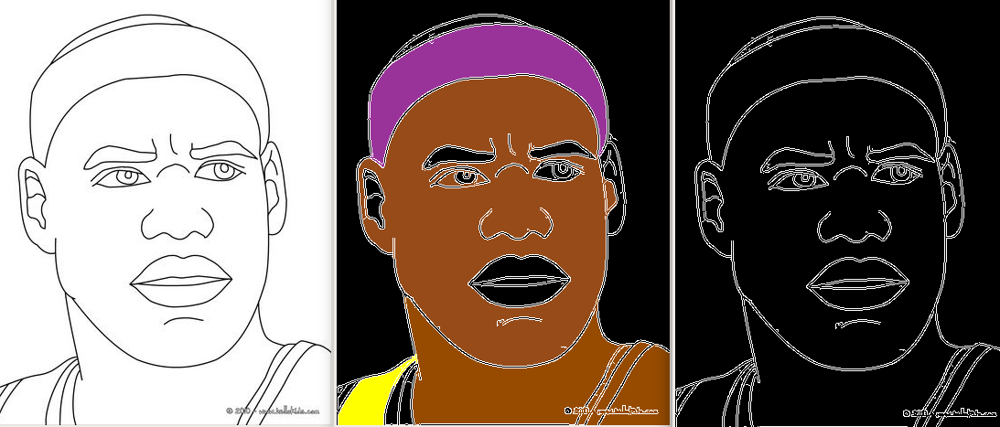
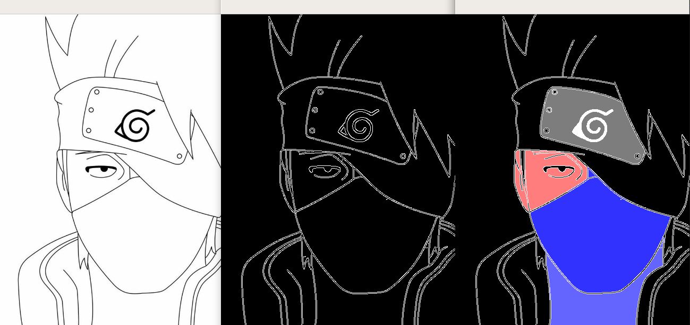
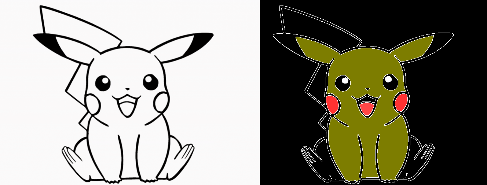

**Número da Lista**: 1 
**Conteúdo da Disciplina**: Grafos 

## Alunos
|Matrícula | Aluno |
| -- | -- |
| 17/0138551|Bruno Duarte|
| 17/0033112|Eugênio Sales|

## Sobre 
    PB é um projeto que utiliza imagens para detectação de arestas e bordas em preto e branco, cujo intuito é possibilitar a coloração(especificamente das regiões pretas) desta imagem através do algoritmo estudado Flood Fill de forma instantânea ou animada.

## Screenshots

## Depêndecnias

**Linguagem**: [Python3](https://www.python.org/)
 

## Ou execute locamente com virtualenv
- Crie um arquivo virtualenv `virtualenv -p python3 env`
- Ative com `source env/bin/activate`
- Instale os requirimentos `pip install -r requirements.txt`
- Instale o tkinter `sudo apt-get install python3-tk`
- Execute o servidor web gunicorn `gunicorn app:app --bind 0.0.0.0:5000 --reload`

## Uso 
A utilização do projeto requer poucos passos visando facilitar a correção do projeto. Após instalar as duas depêndencias

> 1 - Execute python3 paint.py

Aparecerá a imagem setada como default.png, caso deseje alterar a imagem ou inserir alguma outra imagem, abra o arquivo e mude a referência para a imagem desejada na linha 94. Dependendo da imagem talvez seja necessário redimensionar a imagem na variável scale na linha 97.

Nota: A imagem aparecerá em preto e branco com os contornos detectados. Apoś isso:

> 2 - Clique Duas vezes na região/delimitação preta que você deseja colorir 

> 3 - Insira os valores R, G e B detectados e submeta os valores

> 4 - A janela (Image State) irá mostrar o algoritmo em ação

Pressione ESC caso deseje sair do programa. Também é possível pular a "animação" do algoritmo apenas comentado as linhas 81 e 82 do código, tornando a coloração mais instantânea.

## Outros 
Importante ressaltar que o foco do projeto era demonstrar o algoritmo em ação, logo algumas arestas e regiões detectadas podem não estar com seus contornos exatamente fechados o que pode acarretar na coloração de uma região bem maior que a esperada. Durante a animação é possível notar essa carência de arestas e bordas em alguns casos. 

## Restrições
 * A coloração do algoritmo acontece apenas nas regiões pretas [0,0,0]

 * Não é possível, até o presente momento, recolorir as regiões

* Redimensionar a imagem pode alterar o contorno/fechamento das arestas, procure sempre deixa em um formato proporcional adequado (por exemplo a imagem default.png funciona com o scale em 80)

* As dimensões da imagem podem ser alteradas a partir da porcentagem pela variável _scale_ na linha 97

* O vídeo demonstrativo está presente na pasta raiz do projeto 

